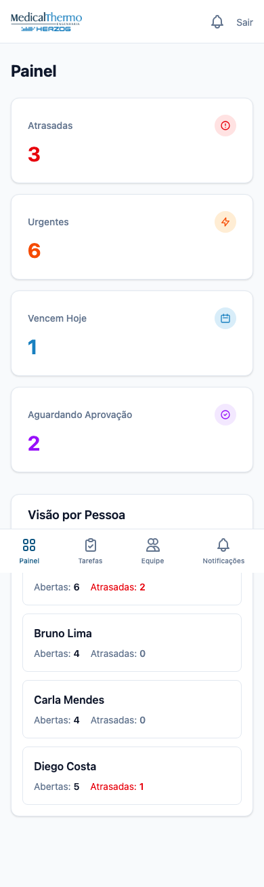
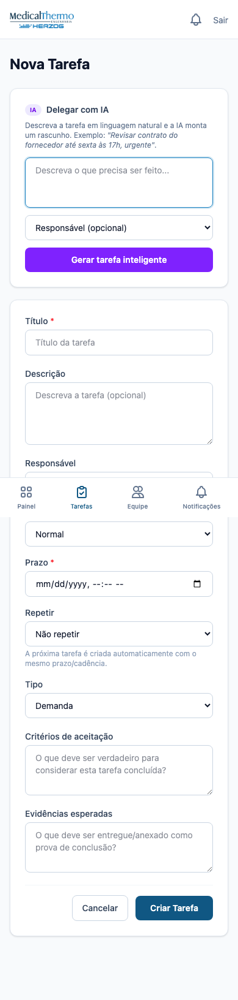
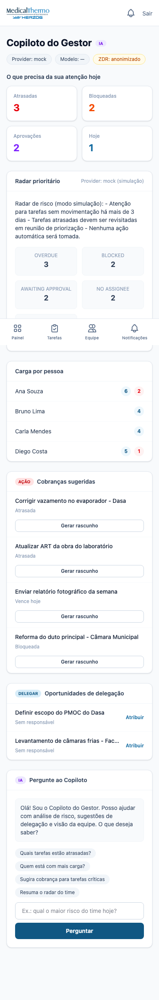
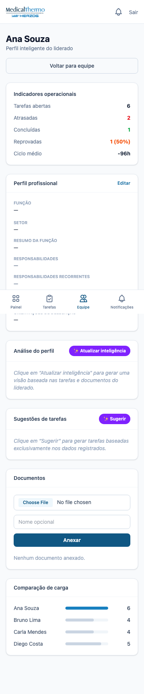

# 29 — Manual do Usuário

> Manual de uso do **Sistema de Gestão de Tarefas para Liderados** —
> MedicalThermo. Instruções para gestor e liderado, com capturas de tela
> reais do ambiente de demonstração.

---

## Para o Gestor

### 1. Painel de controle

Ao fazer login, o gestor vê o painel com os principais indicadores do dia:

- **Atrasadas**: tarefas que já passaram do prazo.
- **Urgentes**: tarefas marcadas como urgente/crítica.
- **Vencem Hoje**: tarefas com prazo para hoje.
- **Aguardando Aprovação**: entregas que os liderados concluíram e precisam da sua validação.

Abaixo dos contadores há a **Visão por Pessoa**, que mostra quantas tarefas
cada liderado tem abertas e atrasadas.

### 2. Criar uma tarefa

1. Toque em **Tarefas** no menu inferior e depois no botão **Nova Tarefa**.
2. Preencha o título, a descrição (opcional), responsável, prioridade e prazo.
3. Toque em **Criar Tarefa**.

A tarefa será criada no status adequado e o responsável será notificado.

### 3. Delegar com IA

Na tela **Nova Tarefa**, escolha a aba **Delegar com IA**. Descreva o que
precisa ser feito em linguagem natural, por exemplo:

> *"Revisar contrato do fornecedor até sexta às 17h, urgente."*

A IA monta um rascunho completo com:

- Título sugerido
- Tipo da tarefa (demanda, compra, serviço etc.)
- Prioridade e prazo
- Responsável sugerido
- Critérios de aceitação
- Evidências esperadas

Revise o rascunho, ajuste o que for necessário e toque em **Criar Tarefa**.
A IA nunca cria a tarefa sozinha: a decisão final é sempre sua.

### 4. Aprovar ou reprovar uma entrega

1. No painel, toque em **Aguardando Aprovação**.
2. Abra a tarefa, leia o comentário e os anexos enviados.
3. Toque em **Aprovar** (se estiver correto) ou **Reprovar** (escolhendo o motivo).

### 5. Copiloto do Gestor

O **Copiloto** é o assistente de gestão. Acesse pelo menu **Equipe** →
**Copiloto** ou pelo link **Assistente**.

Na tela você encontra:

- **Radar prioritário**: resumo do que precisa da sua atenção hoje.
- **Cobranças sugeridas**: rascunhos de mensagem para tarefas atrasadas/bloqueadas.
- **Oportunidades de delegação**: tarefas sem responsável que podem ser atribuídas.
- **Chat com o Copiloto**: faça perguntas como *"Quais tarefas estão atrasadas?"*
  ou *"Quem está com mais carga?"*. O Copiloto busca dados reais do sistema
  (quando a IA estiver configurada) e nunca executa ações automaticamente.

O Copiloto só pode ser usado por gestores.

### 6. Acompanhar a equipe

1. Toque em **Equipe** no menu inferior.
2. Toque no nome do liderado para abrir o **Perfil Inteligente**.
3. Veja os indicadores operacionais (tarefas abertas, atrasadas, concluídas,
   reprovadas, ciclo médio), o perfil profissional, sugestões de tarefas e
   documentos anexados.

Você pode **Atualizar inteligência** para gerar um resumo do perfil baseado
nas tarefas e documentos do liderado, ou **Sugerir** tarefas compatíveis com
suas responsabilidades e objetivos.

---

## Para o Liderado

### Como ver minhas tarefas

1. Faça login — a tela inicial já mostra **Urgentes**, **Hoje** e **Próximas**.
2. Toque em qualquer tarefa para ver os detalhes.

### Como registrar andamento

1. Abra a tarefa.
2. Escreva um comentário contando o que foi feito.
3. Anexe uma foto, comprovante ou PDF se necessário.

### Como solicitar conclusão

1. Quando terminar, toque em **Solicitar conclusão**.
2. Aguarde a aprovação do gestor.

### Como marcar uma tarefa como bloqueada

1. Abra a tarefa.
2. Toque em **Marcar como bloqueada**.
3. Explique o motivo e de quem depende.

---

## Segurança e privacidade da IA

- Por padrão, a IA trabalha em **modo anonimizado** (ZDR ativo). Nomes,
  e-mails e dados sensíveis são substituídos por tokens antes de saírem do
  servidor.
- O gestor pode confirmar o ZDR no `.env` de produção para permitir que a IA
  use dados reais.
- A IA **nunca cria, altera ou exclui tarefas sozinha**. Ela sempre gera
  rascunhos para revisão humana.

---

## Perguntas frequentes

**A IA funciona sem configurar API key?**
Sim, mas em modo simulação. As respostas serão genéricas e não usarão dados
reais. Configure `GROQ_API_KEY` (ou outro provider) para respostas geradas
por IA.

**O liderado pode usar o Copiloto?**
Não. O Copiloto e as funções de IA são restritas ao gestor.

**Posso editar o rascunho gerado pela IA?**
Sim. O rascunho aparece no formulário de criação/edição e pode ser alterado
antes de salvar.

**Os documentos do perfil são seguros?**
Sim. Eles ficam armazenados no servidor, são acessíveis apenas pelo gestor
sobre o liderado e são processados em chunks locais (sem vector DB externo).

---

*Última atualização deste manual: 2026-08-26 — Fase 27 (Copiloto Inteligente do Gestor).*
